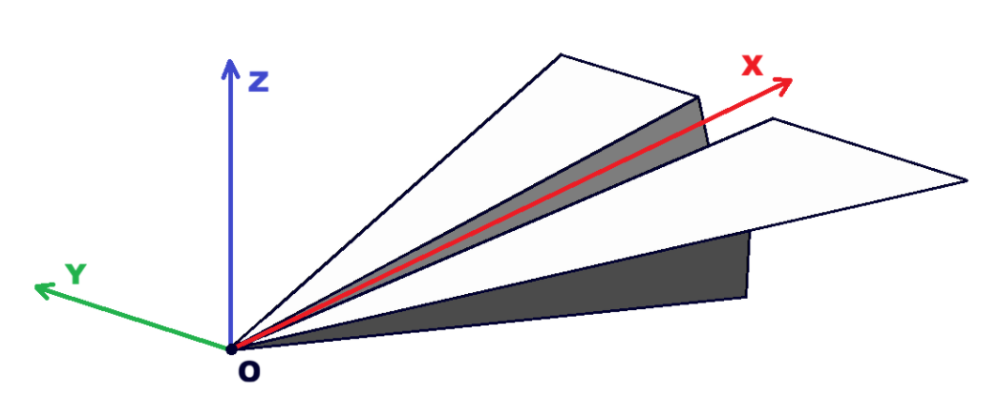
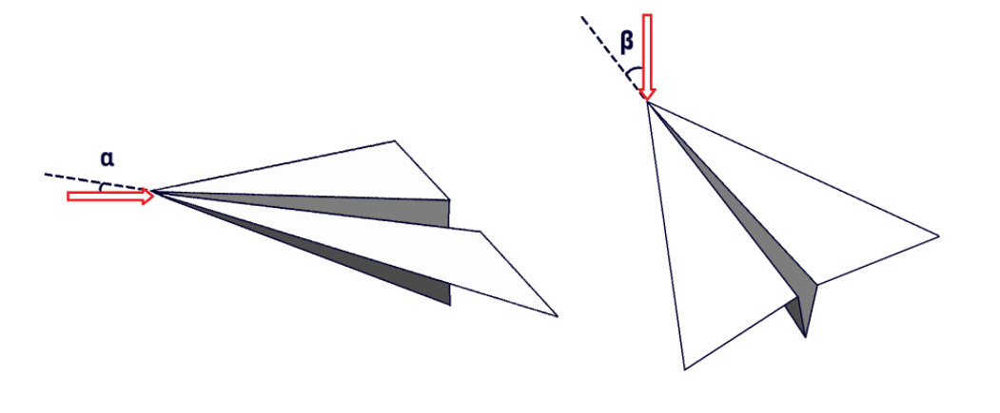

# Sign Conventions

Sign conventions used throughout the code development

## Plane Coordinate System

In order to balance physical reference, calculation complexity, and CAD axis, we defined the coordinate system using the aircraft as reference.

The following coordinate system was used, where X axis is aft, Z axis is upward, and Y axis is starboard (completing the right orthogonal system). The origin is defined as the root leading edge of the aircraft's first surface.

## Wind Direction

The wind direction is defined by two angles:

- alpha: incidence angle or pitch angle
- beta: sideslip angle

The wind direction is always assumed to be parallel to the ground to satisfy non-penetration condition.

## Sweep

Sweep is defined as a function of the semi span fraction, starting from the root. It returns the angle made by the reference line (`sw_center`) of the surface with the Y-Z plane at station y.

Positive sweep moves the section aft (+X) along the span.

!!! danger "Important"
    Sweep angle must never equal 90 degrees.

## Dihedral

Dihedral is defined as a function of the semi span fraction, starting from the root. It returns the angle made by the surface's untwisted leading edge with the X-Y plane at station y.

Positive dihedral moves the section up (+Z) along the span.

!!! danger "Important"
    Sweep angle must never equal 90 degrees.

## Twist

Twist is defined as a function of the semi span fraction, starting from the root. It returns the angle by which each section rotate at station y.

Positive twist pitches the section up along the span.